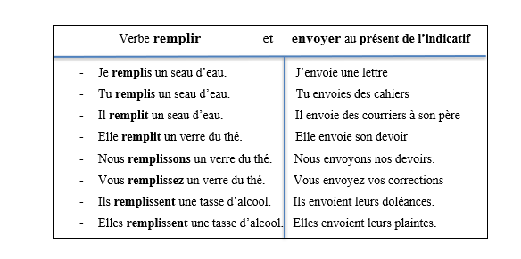

# Conversion Issues

1.  Some sublists are not sublisted

Eg.  
 -> Heading 1 - item 1 - item 2 - item 3

BECOMES

- Heading 1 - item 1 - item 2 - item 3

2.  Tables with cells spanning mulitple columns or rows are not really formatted right.
3.  Tabs are not read as tabs
4.  Charts and Drawings like below are not rendered. [Project PainTa]
    
5.  Underlined are not underlined in the result html
6.  Remove all links and ids, some text in docx don't show this but they really are.
7.  Remove 'alts' from images

# Information - For Science!

- Textboxes do not render
  
- 5.  The underlined text may not be underlined, but at packed in span with id = 'underline', replace the span with a 'u'
