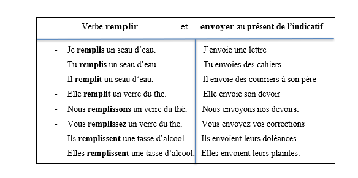
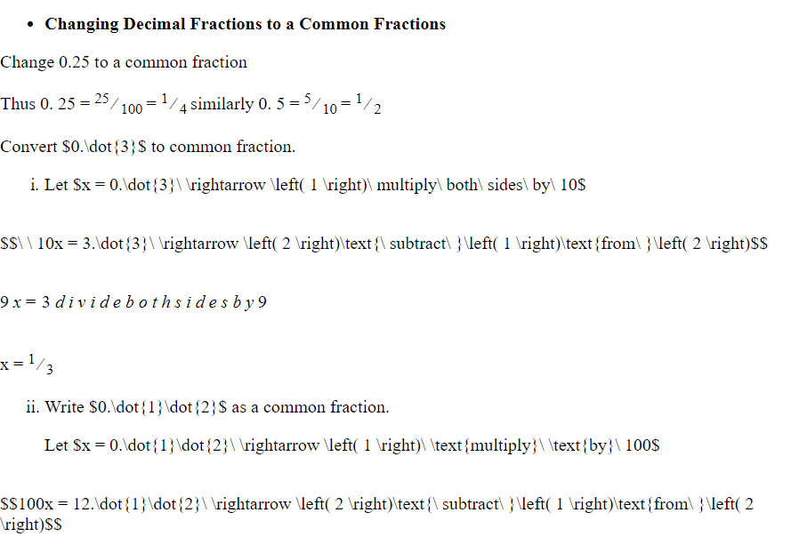
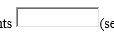

# Conversion Issues

1.  Some sublists are not sublisted

Eg.  
 -> Heading 1 - item 1 - item 2 - item 3

BECOMES

- Heading 1 - item 1 - item 2 - item 3

- [ ] 2.  Tables with cells spanning mulitple columns or rows are not really formatted right.
- [ ] 3.  Tabs are not read as tabs
- [ ] 4.  Charts and Drawings like below are not rendered. [Project PainTa]
    

2. Some maths symbols cannot be rendered properly. This is because there's no html equivalent 
    1. Unsupported Characters 
        - 'matrix' -> Used for additions and subtraction, primary style
        - '.dot' -> Number with dot on top
        - 'right arrow' -> '->'
        - 'overrightarrow' -> Vector with arrow on top to show line 
     

# Information - For Science!

- Textboxes do not render
  
