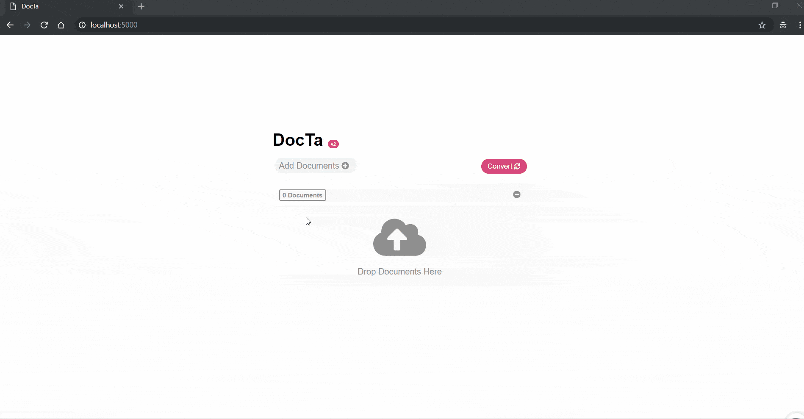

# DocTa
This app helps convert word documents to barebones HTML (without styling), and according to certain formatting rules (eg. img must have width 100%)

## Installation 
- Install python3 upwards
- Run `pip3 -r requirements.txt`
- Install [Pandoc](https://github.com/jgm/pandoc/releases/tag/2.7.3), [Latex](https://miktex.org/download) and [HTML-Tidy](http://binaries.html-tidy.org/). Make sure they are added to path

## Running DocTa
Run DocTa by accessing: `python3 docta.py`  
Access DocTa at `localhost:8080`

## Screenshots 

